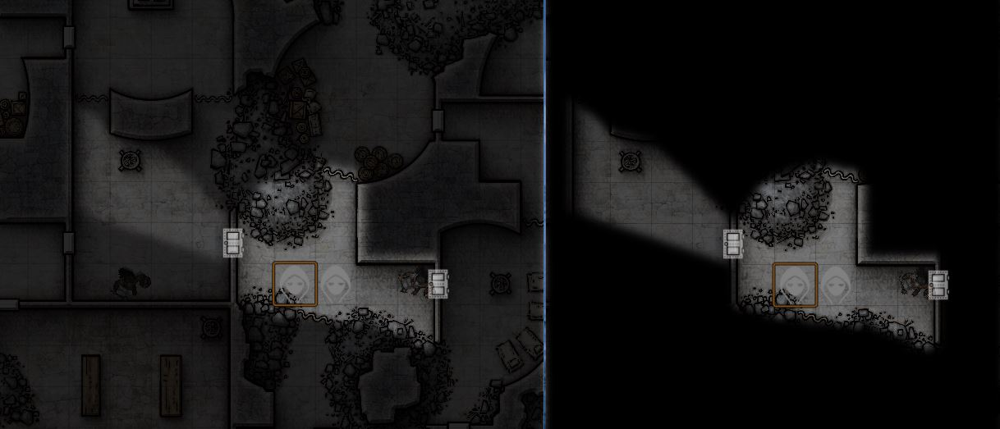

# FVTT Patches
Module to apply the following patches to Foundry VTT:
  * **patchFog**: Allow GM to see through the FOW and to see all tokens on the canvas.
  * **patchSound**: Apply volume easing to selected volume level of sound effect.
  * **patchDice**: Average of 2d20 rolls for normal checks and saves; limit dice to reroll (applies to the dnd5e system).

All patches rely on the **patchClass** utility function. 
  
Effect of **patchFog**: compare GM view on the left to Player view on the right

# Installation
Extract the patches.zip file to the public/modules directory. As DM go to the `Manage Modules` options menu in your World ('?' icon on the side bar) then enable the `Gamemaster FOW` module.  If not all patches are desired, edit modules.json to delete references to unwanted patches.  Do not delete the reference to patchClass.js.  This utility function is used to apply the patches and is required.

# License
This Foundry VTT module, written by trdischat with major assistance from KaKaRoTo, is licensed under a [Creative Commons Attribution 4.0 International License](http://creativecommons.org/licenses/by/4.0/).

This work is licensed under Foundry Virtual Tabletop [EULA - Limited License Agreement for module development v 0.1.6](http://foundryvtt.com/pages/license.html).
